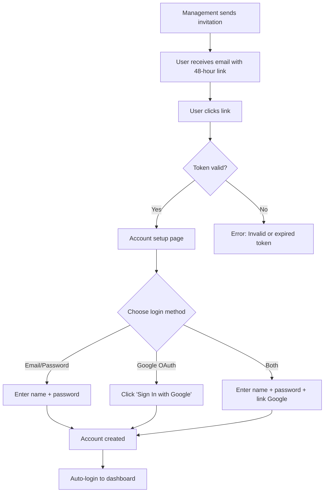
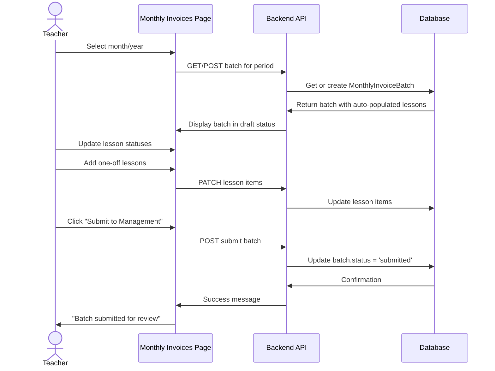
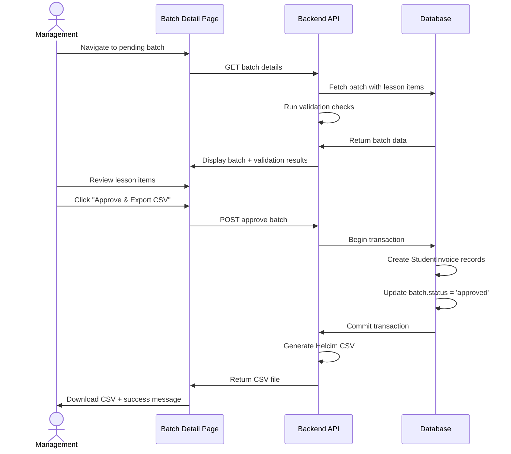
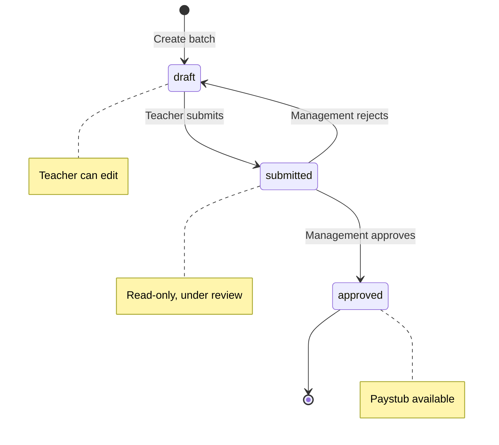
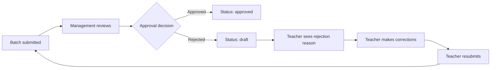
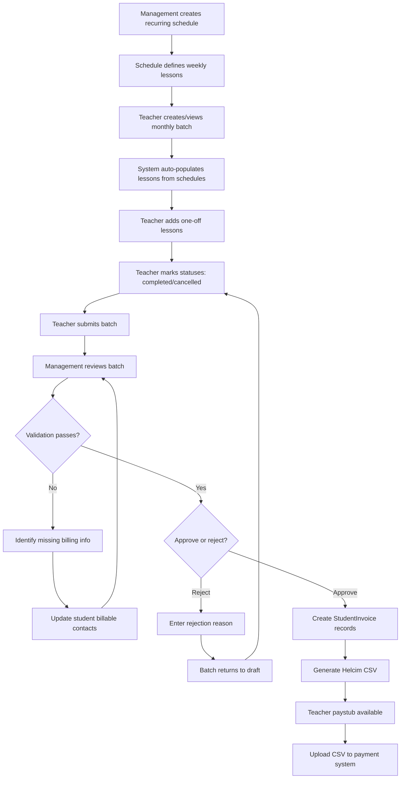
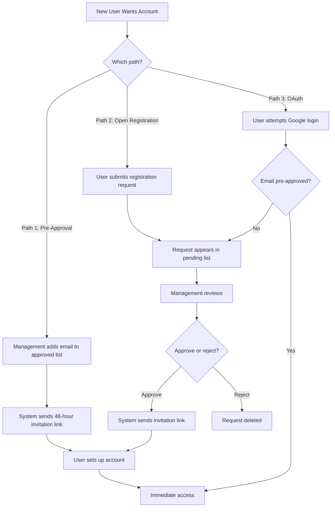

# Maple Key Music Academy - User Guide

**Version:** 1.0.0
**Last Updated:** April 27, 2026
**Document Purpose:** Comprehensive guide for teachers and management users

---

## Version History

| Version | Date | Changes | Author |
|---------|------|---------|--------|
| 1.0.0 | 2026-04-27 | Initial comprehensive user guide | Management |

---

## Table of Contents

### Part 1: Universal Content (All Users)
1. [Getting Started](#1-getting-started)
   - [1.1 Registration & Account Setup](#11-registration--account-setup)
   - [1.2 Logging In](#12-logging-in)
   - [1.3 Understanding Your Dashboard](#13-understanding-your-dashboard)
2. [Quick Start Guides](#2-quick-start-guides)
   - [2.1 Teacher Quick Start](#21-teacher-quick-start)
   - [2.2 Management Quick Start](#22-management-quick-start)

### Part 2: Teacher Documentation
3. [Monthly Invoice Workflow](#3-monthly-invoice-workflow)
   - [3.1 Understanding Monthly Invoices](#31-understanding-monthly-invoices)
   - [3.2 Creating Your Monthly Invoice](#32-creating-your-monthly-invoice)
   - [3.3 Managing Lesson Items](#33-managing-lesson-items)
   - [3.4 Lesson Types and Rates](#34-lesson-types-and-rates)
   - [3.5 Submitting Your Invoice](#35-submitting-your-invoice)
   - [3.6 Viewing Past Invoices and Paystubs](#36-viewing-past-invoices-and-paystubs)
   - [3.7 Handling Rejections](#37-handling-rejections)
4. [My Students & Schedules](#4-my-students--schedules)
   - [4.1 Viewing Your Students](#41-viewing-your-students)
   - [4.2 Understanding Recurring Schedules](#42-understanding-recurring-schedules)
5. [Paystubs & Records](#5-paystubs--records)
   - [5.1 Accessing Your Paystubs](#51-accessing-your-paystubs)
   - [5.2 Understanding Your Paystub](#52-understanding-your-paystub)
   - [5.3 Tax Record Keeping](#53-tax-record-keeping)

### Part 3: Management Documentation
6. [Batch Approval Workflow](#6-batch-approval-workflow)
   - [6.1 Understanding the Batch System](#61-understanding-the-batch-system)
   - [6.2 Accessing Pending Batches](#62-accessing-pending-batches)
   - [6.3 Reviewing a Batch in Detail](#63-reviewing-a-batch-in-detail)
   - [6.4 Validation Checks Before Approval](#64-validation-checks-before-approval)
   - [6.5 Editing Lesson Notes](#65-editing-lesson-notes)
   - [6.6 Approving a Batch](#66-approving-a-batch)
   - [6.7 Rejecting a Batch](#67-rejecting-a-batch)
   - [6.8 Viewing Approved Batches](#68-viewing-approved-batches)
7. [Student Management](#7-student-management)
   - [7.1 Accessing Student Management](#71-accessing-student-management)
   - [7.2 Creating New Students](#72-creating-new-students)
   - [7.3 Viewing Student Details](#73-viewing-student-details)
   - [7.4 Managing Billable Contacts](#74-managing-billable-contacts)
   - [7.5 Assigning Teachers to Students](#75-assigning-teachers-to-students)
   - [7.6 Creating Recurring Schedules](#76-creating-recurring-schedules)
8. [Teacher Management](#8-teacher-management)
   - [8.1 Viewing All Teachers](#81-viewing-all-teachers)
   - [8.2 Updating Teacher Hourly Rates](#82-updating-teacher-hourly-rates)
   - [8.3 Viewing Teacher Students](#83-viewing-teacher-students)
9. [Recurring Schedules](#9-recurring-schedules)
   - [9.1 Understanding Recurring Schedules](#91-understanding-recurring-schedules)
   - [9.2 Creating a Recurring Schedule](#92-creating-a-recurring-schedule)
   - [9.3 Editing and Deactivating Schedules](#93-editing-and-deactivating-schedules)
   - [9.4 How Schedules Auto-Populate Invoices](#94-how-schedules-auto-populate-invoices)
10. [System Settings](#10-system-settings)
    - [10.1 Accessing System Settings](#101-accessing-system-settings)
    - [10.2 Rate Settings](#102-rate-settings)
    - [10.3 Invoice Recipients](#103-invoice-recipients)
    - [10.4 School Information](#104-school-information)
11. [User Approval](#11-user-approval)
    - [11.1 Understanding User Approval System](#111-understanding-user-approval-system)
    - [11.2 Managing Registration Requests](#112-managing-registration-requests)
    - [11.3 Pre-Approving Email Addresses](#113-pre-approving-email-addresses)

### Part 4: Reference & Support
12. [Common Tasks & Workflows](#12-common-tasks--workflows)
    - [12.1 Monthly Workflow (Teachers)](#121-monthly-workflow-teachers)
    - [12.2 Monthly Workflow (Management)](#122-monthly-workflow-management)
    - [12.3 Setting Up a New Student (End-to-End)](#123-setting-up-a-new-student-end-to-end)
    - [12.4 Handling Mid-Month Schedule Changes](#124-handling-mid-month-schedule-changes)
    - [12.5 Correcting Student Billing Information](#125-correcting-student-billing-information)
13. [Error Reference & Troubleshooting](#13-error-reference--troubleshooting)
    - [13.1 Teacher Issues](#131-teacher-issues)
    - [13.2 Management Issues](#132-management-issues)
    - [13.3 Billing Address Issues](#133-billing-address-issues)
    - [13.4 Status Codes Reference](#134-status-codes-reference)
    - [13.5 Common Error Messages](#135-common-error-messages)

---

# Part 1: Universal Content (All Users)

## 1. Getting Started

### 1.1 Registration & Account Setup

**Who This Is For:** New users who have received an invitation email from Maple Key Music Academy.

#### Receiving Your Invitation

Management will send you an invitation email to join the system. This invitation link is valid for **48 hours** from the time it's sent.

**What the invitation email looks like:**

📸 **Screenshot needed: Invitation email example** - Shows subject line, sender, and invitation link

#### Setting Up Your Account

**What you'll do:** Create your account using the invitation link.

**Steps:**

1. **Check your email** for an invitation from Maple Key Music Academy
2. **Click the invitation link** in the email
3. The link will take you to the account setup page
4. **Your email address will be pre-filled** (cannot be changed)
5. **Enter your information:**
   - First Name
   - Last Name
   - Password (optional - see note below)
6. **Click "Create Account"**
7. You'll be automatically logged in and redirected to your dashboard

**Password vs Google Sign-In:**

You have two options when setting up your account:

- **Option A: Set a password** - Enter a password if you want to use email/password login
- **Option B: Skip password and use Google** - Leave password blank and click "Sign In with Google" to use Google OAuth login only
- **Option C: Both** - Set a password AND link Google - gives you both login methods

> **💡 Pro Tip:** We recommend setting a password even if you plan to use Google Sign-In. This gives you a backup login method.

#### User Registration Flow



#### Understanding User Roles

When your account is created, you'll be assigned one of two roles:

**Teacher:**
- Submit monthly invoices with lessons taught
- Mark lesson statuses (completed, cancelled, etc.)
- View assigned students
- Download paystubs for tax records

**Management:**
- Approve/reject teacher invoices
- Create and manage students
- Assign teachers to students
- Create recurring lesson schedules
- Configure system settings (rates, school info)
- Manage user approvals

---

### 1.2 Logging In

**What you'll do:** Access the Maple Key Music Academy system.

**URL:** Your management will provide the login URL (typically https://maplekeymusic.com or similar)

📸 **Screenshot needed: Login page** - Shows both email/password and Google OAuth options

#### Email/Password Login

**Steps:**

1. Navigate to the login page
2. **Enter your email address**
3. **Enter your password**
4. Click **"Sign In"**
5. You'll be redirected to your dashboard based on your role:
   - Teachers → Teacher Dashboard
   - Management → Management Dashboard

#### Google OAuth Login

**Steps:**

1. Navigate to the login page
2. Click **"Continue with Google"** button
3. Select your Google account
4. Grant permissions if prompted
5. You'll be automatically logged in and redirected to your dashboard

#### Forgot Your Password?

**Steps:**

1. Click **"Forgot your password?"** link on the login page
2. Enter your email address
3. Click **"Send Reset Link"**
4. Check your email for a password reset link
5. Click the link and enter your new password
6. Return to the login page and log in with your new password

> **❌ Common Issue:** "Invalid credentials" error
> - **What this means:** Your email or password is incorrect
> - **How to fix:** Double-check your email for typos, ensure Caps Lock is off, or use the "Forgot password" link

---

### 1.3 Understanding Your Dashboard

Your dashboard is the first page you see after logging in. It provides an overview of your key information and quick actions.

#### Teacher Dashboard

**What you'll see:**

- **Invoice Statistics Cards** (4 cards):
  - Pending Invoices - Number of invoices awaiting management review
  - Rejected Invoices - Invoices that need corrections
  - Approved Invoices - Invoices approved and ready for payment
  - Paid Invoices - Invoices for which you've been paid
- **Recent Rejections Preview** - Last 5 rejected invoices with rejection reasons
- **Success Rate** - Percentage of invoices approved on first submission

**Quick Actions:**
- **Submit New Invoice** button → Takes you to the Monthly Invoices page
- **View Invoice History** button → Takes you to Paystubs page

📸 **Screenshot needed: Teacher dashboard** - Shows statistics cards and quick actions

#### Management Dashboard

**What you'll see:**

- **System Statistics Cards** (4 cards):
  - Pending User Approvals - Number of registration requests awaiting review
  - Pending Invoices - Teacher invoices awaiting your approval
  - Active Users - Total number of active users in the system
  - Total Invoices - All-time invoice count

**Quick Actions:**
- **Manage User Approvals** button → Takes you to User Approval page
- **Manage Invoices** button → Takes you to Invoice Review page
- **Recent Registration Requests** - Last 3 pending requests with approve/reject buttons

📸 **Screenshot needed: Management dashboard** - Shows statistics cards and quick actions

#### Sidebar Navigation

Both roles have a collapsible sidebar on the left with:
- **Logo and school name** at the top
- **Navigation menu** with role-specific pages
- **User profile section** at the bottom with your name and role
- **Logout button** in the top-right corner

---

## 2. Quick Start Guides

### 2.1 Teacher Quick Start

**Goal:** Submit your first monthly invoice in 5 minutes.

**Steps:**

1. **Navigate to Monthly Invoices**
   - Click "Invoices" in the sidebar, then "Monthly Invoices"
   - Or click "Submit New Invoice" from the dashboard

2. **Select Month and Year**
   - Use the month selector to choose the period
   - The system will load or create your batch for that month
   - Your recurring lessons will auto-populate

3. **Review and Update Lesson Statuses**
   - Look through the lesson items table
   - For each lesson, update the status:
     - **Completed** - Lesson was taught
     - **Cancelled** - Lesson was cancelled (select who cancelled and why)
     - **Confirmed** - Lesson is scheduled but not yet taught

4. **Add One-Off Lessons (if any)**
   - Click "Add Lesson" if you taught extra lessons not in your schedule
   - Fill in student, date, time, duration, and mark as completed

5. **Submit to Management**
   - Click "Submit to Management" button
   - Confirm in the popup
   - Your batch is now under review

6. **Wait for Approval**
   - You'll see a status change to "Under Review"
   - Management will review and either approve or reject
   - If approved, download your paystub from the Paystubs page

#### Teacher Invoice Submission Flow



---

### 2.2 Management Quick Start

**Goal:** Approve your first teacher batch in 5 minutes.

**Steps:**

1. **Navigate to Batch Review**
   - Click "Invoice Review" in the sidebar
   - You'll see the "Pending Review" tab

2. **Select a Batch to Review**
   - Click "Review" button on any pending batch
   - You'll see the batch detail page

3. **Review Lesson Details**
   - Check each lesson in the table:
     - Student name correct?
     - Date and time accurate?
     - Lesson type correct (online/in-person)?
     - Payment amounts look right?
   - Review teacher notes for any cancellations or special circumstances

4. **Check Validation**
   - The system automatically checks if all students have complete billing information
   - If you see red validation errors, fix them before approving (see Section 6.4)

5. **Approve the Batch**
   - If everything looks good, click "Approve & Export CSV"
   - Review the confirmation modal
   - Click "Approve & Export"
   - CSV file will download automatically

6. **Upload to Payment System**
   - Take the downloaded CSV file
   - Upload to Helcim (or your payment processing system)
   - Mark payment method and date in the approved batch (optional)

#### Management Approval Flow



---

# Part 2: Teacher Documentation

## 3. Monthly Invoice Workflow

### 3.1 Understanding Monthly Invoices

**What are monthly invoice batches?**

A monthly invoice batch is your submission of all lessons you taught during a specific month. Instead of submitting individual lessons, you submit one batch per month containing all lesson items.

**Key Concepts:**

**Recurring Lessons:**
- Management creates weekly recurring schedules for your regular students
- These lessons auto-populate in your monthly batch
- Example: If Sarah has piano lessons every Tuesday at 4pm, the system automatically adds all Tuesdays in the month

**One-Off Lessons:**
- Makeup lessons, trial lessons, or schedule changes
- You manually add these to your batch

**Lesson Statuses:**
- `completed` - You taught the lesson (you get paid, student gets billed)
- `cancelled` - Lesson was cancelled (no payment for either party)
- `confirmed` - Lesson is scheduled but not yet taught

**Batch Statuses:**



**Dual-Rate System:**

You get paid one rate, students are charged a different rate:

| Lesson Type | Teacher Rate | Student Rate | School Margin |
|-------------|--------------|--------------|---------------|
| Online | $45/hr (global setting) | $60/hr (global setting) | $15/hr |
| In-Person | Your hourly_rate (e.g., $50/hr) | $100/hr (global setting) | Variable |

> **💡 Important:** Rates are locked when the recurring schedule is created. If management changes rates later, your existing schedules keep the original rates.

**Trial Lessons:**

- First-time students get their first lesson free
- **You still get paid** your normal rate
- Student is charged $0
- System auto-detects trial lessons

---

### 3.2 Creating Your Monthly Invoice

**What you'll do:** Access and set up your monthly invoice batch.

**Prerequisites:** None - you can do this at any time during or after the month.

**Steps:**

1. **Navigate to Monthly Invoices Page**
   - Click "Invoices" in the sidebar
   - Click "Monthly Invoices"
   - Or click "Submit New Invoice" from the dashboard

2. **Select Month and Year**
   - Use the month/year selector at the top
   - Click the month dropdown
   - Select the desired month and year
   - The page will reload with your batch for that period

📸 **Screenshot needed: Month selector interface** - Shows dropdown with month/year selection

3. **Understand What You See**

The page displays:

- **Batch Information Card:**
  - Period (e.g., "April 2026")
  - Batch number (auto-generated)
  - Status badge (Draft, Submitted, Approved, Rejected)

- **Summary Cards:**
  - Total Lessons - Number of lesson items in batch
  - Completed - Lessons marked as completed
  - Cancelled - Lessons marked as cancelled
  - Total Payment - Your total earnings for the month

- **Lesson Items Table:**
  - All lessons for the month (recurring + one-off)
  - Columns: Student, Date, Time, Duration, Type, Status, Rate, Notes
  - Action buttons: Update status, add notes, delete (one-off only)

📸 **Screenshot needed: Batch in draft status** - Shows all elements including lesson table

**What happens automatically:**

- If this is your first time viewing this month, the system creates a new batch
- All recurring lessons for the month auto-populate from schedules
- Rates are locked at the schedule's creation date
- Batch starts in `draft` status

**Status Indicators:**

- 🟢 **Green row** - Completed lesson
- 🔵 **Blue row** - Rescheduled lesson
- 🔴 **Gray + strikethrough** - Cancelled lesson

---

### 3.3 Managing Lesson Items

**What you'll do:** Update lesson statuses and add/remove lessons from your batch.

#### Marking Lessons as Completed

**When:** After you've taught the lesson.

**Steps:**

1. Find the lesson in the table
2. Click the **Status** dropdown in that row
3. Select **"Completed"**
4. The row turns green
5. Changes save automatically

**What happens:** The lesson is marked as billable. You'll be paid for this lesson when the batch is approved.

#### Cancelling a Lesson

**When:** The lesson was cancelled by you or the student.

**Steps:**

1. Find the lesson in the table
2. Click the **Status** dropdown
3. Select **"Cancelled"**
4. A cancellation modal appears

📸 **Screenshot needed: Cancellation modal** - Shows all fields including who cancelled and reason

5. **In the modal, fill in:**
   - **Who cancelled?** - Select "Teacher" or "Student"
   - **Cancellation reason:** - Enter a brief explanation (required)
6. Click **"Confirm Cancellation"**

**What happens:**
- Row becomes gray with strikethrough text
- You won't be paid for this lesson
- Student won't be charged
- Cancellation reason is saved in notes

> **💡 Pro Tip:** Be specific in cancellation reasons. Examples:
> - "Student sick"
> - "Teacher family emergency"
> - "Student vacation"
> - "Weather - snowstorm"

#### Rescheduling a Lesson

**When:** The lesson was moved to a different date/time.

**Steps:**

1. Find the ORIGINAL lesson in the table
2. Click the **Status** dropdown
3. Select **"Reschedule"**
4. A reschedule modal appears
5. **In the modal:**
   - **New Date:** Select the rescheduled date
   - **New Time:** Enter the new time (HH:MM format)
6. Click **"Confirm Reschedule"**

**What happens:**
- Original lesson row turns blue
- A note is added: "Rescheduled from [original date] to [new date]"
- The lesson still appears on the original date (for record-keeping)
- You should add the rescheduled lesson as a one-off on the new date

> **Important:** Rescheduling does NOT move the lesson. It marks the original and adds a note. You must manually add the new lesson date as a one-off.

#### Adding One-Off Lessons

**When:** You taught a lesson that's not in your recurring schedule (makeup, trial, extra lesson).

**Steps:**

1. Click **"Add Lesson"** button at the top of the table
2. A modal appears
3. **Fill in the form:**
   - **Student:** Select from dropdown (your assigned students)
   - **Date:** Select the date (use date picker or type YYYY-MM-DD)
   - **Time:** Enter time (HH:MM format, e.g., 14:30)
   - **Duration:** Enter hours (e.g., 1.0 for 1 hour, 0.5 for 30 minutes)
   - **Lesson Type:** Select "Online" or "In-Person"
   - **Status:** Select "Completed" or "Confirmed"
   - **Notes:** Optional notes about the lesson
4. Click **"Add Lesson"**

**What happens:**
- Lesson appears in the table
- Marked as "one-off" (can be deleted if you made a mistake)
- Rate auto-calculated based on lesson type and your settings

#### Editing Notes

**When:** You want to add context about a lesson.

**Steps:**

1. Find the lesson in the table
2. Click in the **Notes** field (text area)
3. Type your note
4. Click outside the field or press Tab
5. Changes save automatically

**Examples of useful notes:**
- "Student's first lesson (trial)"
- "Covered Grade 3 exam material"
- "Makeup lesson from March 15th cancellation"

#### Deleting One-Off Lessons

**When:** You added a lesson by mistake.

**Important:** You can ONLY delete one-off lessons. Recurring lessons must be cancelled instead.

**Steps:**

1. Find the one-off lesson in the table
2. Click the **Delete** button (trash icon)
3. Confirm deletion in the popup
4. Lesson is removed from the table

> **❌ Cannot Delete Recurring Lessons**
> - If you try to delete a recurring lesson, you'll get an error
> - Instead, mark it as "Cancelled"

---

### 3.4 Lesson Types and Rates

**Understanding how you get paid:**

#### Online Lessons

**Teacher Rate:** $45/hour (global online teacher rate)
**Student Rate:** $60/hour (global online student rate)
**School Margin:** $15/hour

**Example:**
- You teach a 1-hour online piano lesson
- You receive: $45
- Student is billed: $60
- School keeps: $15

#### In-Person Lessons

**Teacher Rate:** Your personal hourly_rate (set by management)
**Student Rate:** $100/hour (global in-person student rate)
**School Margin:** Variable (depends on your rate)

**Example (if your hourly_rate is $50):**
- You teach a 1-hour in-person guitar lesson
- You receive: $50
- Student is billed: $100
- School keeps: $50

#### Trial Lessons

**Teacher Rate:** Your normal rate (online or in-person)
**Student Rate:** $0 (student not charged)
**School Margin:** Negative (school pays you, student pays nothing)

**How trial lessons are detected:**
- System checks if this is the student's first completed lesson
- If yes → Automatically marked as trial
- You get paid, student gets first lesson free

> **💡 Important:** Trial status is auto-detected. You cannot manually override this after the lesson is completed.

#### Rate Locking

**Critical concept:** Rates are locked when the recurring schedule is created.

**Example scenario:**
1. March 1: Management creates a recurring schedule for Sarah
   - Online rate at that time: $45/hr teacher, $60/hr student
2. March 15: Management increases online rates to $50/hr teacher, $70/hr student
3. Sarah's existing schedule: Still uses $45/$60 (locked at creation)
4. New schedules created after March 15: Use $50/$70

**Why this matters:**
- Fair to teachers (rates don't change retroactively)
- Predictable for students
- If you want new rates, management must create a new schedule

---

### 3.5 Submitting Your Invoice

**What you'll do:** Submit your completed monthly batch to management for approval.

**Prerequisites:**
- At least one lesson item in your batch
- At least one lesson marked as "Completed"

**When to submit:**
- Typically at the end of the month or early the following month
- After you've marked all lessons with their final statuses

**Steps:**

1. **Review Your Batch**
   - Check all lesson statuses are correct
   - Verify completed count matches lessons you taught
   - Review cancellation reasons
   - Check total payment amount

2. **Click "Submit to Management" Button**
   - Located at the top-right of the page

3. **Review Validation**
   - System checks for at least one completed lesson
   - If validation fails, you'll see an error message

4. **Confirm Submission**
   - A confirmation popup appears
   - Shows your total lessons and payment
   - Click **"Submit"** to confirm

📸 **Screenshot needed: Submit button and confirmation modal** - Shows submission workflow

**What happens after submission:**

- Batch status changes to `submitted`
- The page becomes **read-only** (you cannot edit anymore)
- Management receives notification of your submission
- A yellow "Under Review" alert appears on the page
- You'll wait for management to approve or reject

**You'll see:**
```
⚠️ This batch is currently under management review.
You cannot make changes while the batch is submitted.
```

**Timeline:**
- Management typically reviews within 3-5 business days
- You'll receive notification when approved or rejected

> **❌ Common Issue:** "Cannot submit empty batch"
> - **What this means:** You have no lesson items, or no completed lessons
> - **How to fix:** Add at least one lesson and mark it as completed

---

### 3.6 Viewing Past Invoices and Paystubs

**What you'll do:** Access your approved invoices and download paystubs for tax records.

**Where to find them:**
- Click "Invoices" in sidebar → "Payment History"
- Or click "View Invoice History" from dashboard

#### Paystubs Page Overview

**What you'll see:**

- **Statistics Cards** (top of page):
  - Total Paystubs - Number of approved batches
  - Total Earnings - Sum of all approved payments
  - Total Lessons - Count of all completed lessons

- **Year Filter** - Dropdown to filter by year

- **Paystubs Table:**
  - Period (e.g., "April 2026")
  - Batch Number
  - Number of Lessons
  - Total Payment
  - Payment Method (e-transfer, cheque, direct deposit)
  - Payment Date
  - Download button

📸 **Screenshot needed: Paystubs table** - Shows approved batches with download buttons

#### Downloading a Paystub

**Steps:**

1. Find the approved batch in the table
2. Click the **"Download"** button in the Download column
3. PDF file downloads to your computer
4. Open the PDF to view your paystub

**Paystub filename format:** `paystub_[batch-number]_[period].pdf`

**Example:** `paystub_INV-00123_April-2026.pdf`

---

### 3.7 Handling Rejections

**What happens when your batch is rejected:**

Management reviews your batch and finds an issue that needs correction. They'll reject the batch with a detailed reason explaining what needs to be fixed.

**How you'll know:**
- Batch status changes from `submitted` back to `draft`
- Red "Invoice Rejected" alert appears on the Monthly Invoices page
- Rejection reason is displayed prominently

**What you'll see:**
```
❌ This batch was rejected by [Manager Name] on [Date]

Rejection Reason:
"Please verify Sarah Johnson's lesson on April 15th - she was on vacation that week.
Also add cancellation reason for Michael Chen's lesson on April 22nd."
```

#### Steps to Handle a Rejection

**1. Read the Rejection Reason Carefully**
- Management will explain exactly what needs to be fixed
- Common reasons:
  - Incorrect lesson dates
  - Missing cancellation reasons
  - Student was not actually present
  - Duplicate lessons

**2. Make the Required Corrections**
- The batch is now back in `draft` status (editable)
- Update the lessons as requested
- Add missing information
- Delete incorrect entries
- Add explanatory notes if needed

**3. Resubmit the Batch**
- Once corrections are complete, click "Submit to Management" again
- Batch goes back to `submitted` status
- Rejection reason is cleared
- Management reviews again

**Example Rejection Handling:**

```
Rejection: "Sarah Johnson lesson on April 15th - please confirm. She reported being sick that day."

Fix:
1. Find Sarah's lesson on April 15th
2. Change status to "Cancelled"
3. Select "Student" as who cancelled
4. Enter reason: "Student sick"
5. Resubmit batch
```

#### Rejection Handling Workflow



> **💡 Pro Tip:** To avoid rejections:
> - Double-check lesson dates against your calendar
> - Add detailed notes for unusual circumstances
> - Mark cancellations promptly with clear reasons
> - Verify student names (avoid typos)

---

## 4. My Students & Schedules

### 4.1 Viewing Your Students

**What you'll do:** See which students are assigned to you.

**Where to find it:**
- This information is visible in the "Add Lesson" dropdown on the Monthly Invoices page
- Management assigns students to you

**What you can see:**
- Student names
- Student email addresses (in add lesson form)

**What you cannot do:**
- You cannot assign students to yourself
- You cannot see full student details (billing info, other teachers)
- These are management functions

> **Note:** If you need a student assigned to you, contact management.

---

### 4.2 Understanding Recurring Schedules

**What are recurring schedules?**

Recurring schedules are weekly lesson patterns that management creates for your regular students. They automatically generate lesson items in your monthly batches.

**Example:**
- Student: Sarah Johnson
- Day: Tuesday
- Time: 4:00 PM
- Duration: 1 hour
- Type: Online
- Status: Active

**What this means:**
- Every Tuesday in every month, a lesson item for Sarah is automatically added to your batch
- You just need to mark it as completed or cancelled
- No manual entry required for regular weekly lessons

**How many lessons are generated:**

The system counts all Tuesdays in the month:
- March 2026 has 4 Tuesdays → 4 lessons auto-added
- April 2026 has 5 Tuesdays → 5 lessons auto-added

**Schedule Start and End Dates:**

- **Start Date:** When the recurring schedule begins generating lessons
  - If start date is April 15th, only Tuesdays from April 15th onward appear
- **End Date:** When the recurring schedule stops (optional)
  - If end date is June 30th, lessons stop generating after that date
  - If no end date, lessons continue indefinitely

**Active vs Inactive Schedules:**

- **Active:** Lessons are generated each month
- **Inactive:** No lessons generated (schedule is paused or ended)
- Management can toggle this status

**Why you don't create these yourself:**

- Requires access to student billing information
- Locks in rates at creation time
- Needs to match student's enrollment and payment plan
- Management handles this during student onboarding

> **💡 If you need a recurring schedule:**
> - New student enrolled? Ask management to create the schedule
> - Student changed their weekly time? Ask management to update the schedule
> - Student taking a break? Ask management to set an end date or mark inactive

---

## 5. Paystubs & Records

### 5.1 Accessing Your Paystubs

**Where to find them:**
- Sidebar: "Invoices" → "Payment History"
- Or: Dashboard → "View Invoice History" button

**When paystubs are available:**
- After management approves your monthly batch
- Batch status must be `approved`

**Paystub vs Invoice:**
- **Paystub (what you download):** Summary of your payment for tax records
- **Invoice (internal):** Detailed line items that management reviews

---

### 5.2 Understanding Your Paystub

**What's on your paystub PDF:**

**Header Section:**
- School name and business information
- School logo
- Your name and contact information
- Period (month/year)
- Batch number

**Payment Summary:**
- Number of lessons taught (completed only)
- Total payment amount
- Payment method (e-transfer, cheque, direct deposit)
- Payment date

**Footer:**
- "This paystub is for your tax records"
- School contact information

**Example Paystub:**

```
MAPLE KEY MUSIC ACADEMY
123 Main Street, Toronto, ON M5H 2N2
HST #: 123456789RT0001

TEACHER PAYSTUB

Teacher: Julia Martinez
Period: April 2026
Batch Number: INV-00123
Date Issued: May 5, 2026

PAYMENT SUMMARY
-----------------------------------
Lessons Taught: 18
Total Payment: $810.00
Payment Method: E-Transfer
Payment Date: May 10, 2026

-----------------------------------
This paystub is for your tax records.
Please retain for income reporting purposes.
```

**Important Details:**

- **Lessons count:** Only COMPLETED lessons (cancelled lessons excluded)
- **Payment calculation:** Sum of (teacher_rate × duration) for all completed lessons
- **No breakdown:** Paystub doesn't list individual lessons (management has detailed invoice)

---

### 5.3 Tax Record Keeping

**Why paystubs matter:**

You are typically an independent contractor, not an employee. You're responsible for reporting income and paying taxes.

**What to do with paystubs:**

1. **Download immediately** when batch is approved
2. **Save in a tax folder** on your computer (e.g., "Tax_2026/Paystubs")
3. **Keep digital and/or printed copies** for at least 7 years (CRA requirement)
4. **Track total annual income** from all paystubs

**Tax Reporting (Canada):**

- Report income on **Line 13500** (Self-employment business income) of your T1 tax return
- You may need to file a **T2125 Statement of Business Activities**
- Track expenses (instrument purchases, home office, travel to lessons)
- Consider quarterly tax installments if earning over $3,000/year
- Consult a tax professional for specific guidance

**Payment Method Tracking:**

Your paystub shows how you were paid:
- **E-transfer:** Check your email for transfer
- **Cheque:** Check your mail
- **Direct Deposit:** Check your bank account

> **💡 Pro Tip:** Create a spreadsheet tracking:
> - Month
> - Batch number
> - Lessons taught
> - Payment amount
> - Payment date
> - Running annual total

**Example tracking spreadsheet:**

| Month | Batch # | Lessons | Payment | Date Paid | Annual Total |
|-------|---------|---------|---------|-----------|--------------|
| January | INV-001 | 20 | $900 | Feb 5 | $900 |
| February | INV-002 | 18 | $810 | Mar 5 | $1,710 |
| March | INV-003 | 22 | $990 | Apr 5 | $2,700 |

---

# Part 3: Management Documentation

## 6. Batch Approval Workflow

### 6.1 Understanding the Batch System

**What is the batch system?**

The batch system is how teachers submit their monthly invoices and how you review and approve them.

**Key Components:**

**MonthlyInvoiceBatch:**
- One batch per teacher per month
- Contains all lessons for that period
- Tracks status (draft, submitted, approved, rejected)

**BatchLessonItem:**
- Individual lesson within a batch
- Pre-approval record (before creating actual invoices)
- Can be from recurring schedule or one-off

**StudentInvoice:**
- Created AFTER you approve a batch
- One invoice per student for lessons in that batch
- Sent to student for payment

**Complete Batch Lifecycle:**



**Your Role:**

1. **Review** submitted batches for accuracy
2. **Validate** student billing information is complete
3. **Approve** batches that are correct
4. **Reject** batches that need corrections
5. **Export** CSV files for payment processing
6. **Track** payment completion

---

### 6.2 Accessing Pending Batches

**Where to find them:**
- Sidebar: "Invoice Review"
- Or: Dashboard → "Manage Invoices" button

**The Batch Review Page:**

You'll see **three tabs:**

📸 **Screenshot needed: Batches page with three tabs** - Shows Pending/Approved/Rejected tabs with badge counts

**1. Pending Review Tab (Red badge)**
- Shows all submitted batches awaiting your review
- Badge shows count (e.g., "Pending Review (3)")
- These need your action

**2. Approved Tab (Gray badge)**
- Shows all batches you've approved
- Badge shows count
- Reference for completed reviews

**3. Rejected Tab (Gray outline badge)**
- Shows all batches you've rejected
- Badge shows count
- Teachers are working on corrections

**Batch Table Columns:**

- **Teacher Name** - Who submitted the batch
- **Invoice Number** - Auto-generated batch number (e.g., INV-00123)
- **Period** - Month and year (e.g., "April 2026")
- **Lessons** - Total lesson items in batch
- **Completed** - Number marked as completed
- **Cancelled** - Number marked as cancelled
- **Teacher Payout** - Total amount to pay teacher
- **Student Billing** - Total amount to bill students
- **Submitted Date** - When teacher submitted
- **Action** - "Review" button (pending) or "View" button (approved/rejected)

**Filtering and Sorting:**

- **Search bar** - Filter by teacher name or invoice number
- **Sort columns** - Click column headers to sort
- Most recent submissions appear first by default

---

### 6.3 Reviewing a Batch in Detail

**What you'll do:** Open a batch and examine all lesson details.

**Steps:**

1. Navigate to "Pending Review" tab
2. Click **"Review"** button on any batch
3. Batch detail page opens

**Batch Detail Page Layout:**

**Summary Section (Top):**
- Teacher name
- Period (month/year)
- Batch number
- Submission date
- Status badge

**Statistics Cards:**
- Total Lessons
- Completed Lessons
- Cancelled Lessons
- Teacher Payout Amount
- Student Billing Total

**Validation Status:**
- Green checkmark if all validations pass
- Red alert if student billing info incomplete (see Section 6.4)

**Lesson Items Table:**

📸 **Screenshot needed: Batch detail page with lesson items table** - Shows all columns and action buttons

**Table Columns:**
- **Student Name** - Who the lesson is for
- **Date** - Lesson date
- **Time** - Lesson time
- **Duration** - Hours (e.g., 1.0, 0.5)
- **Type** - Online or In-Person (badge)
- **Status** - Completed, Cancelled, Confirmed (badge with color)
- **Teacher Payment** - Amount teacher receives
- **Student Charge** - Amount student is billed
- **Notes** - Teacher notes, cancellation reasons

**Visual Indicators:**

- 🟢 **Green badge** - Completed status
- 🔴 **Red badge** - Cancelled status
- 🔵 **Blue badge** - Confirmed status (not yet taught)
- **Strikethrough text** - Cancelled lessons
- **Bold text** - One-off lessons (not from schedule)

**What to check:**

1. **Dates are accurate**
   - Do lesson dates fall within the correct month?
   - Do cancelled lessons have reasonable dates?

2. **Student names are correct**
   - Watch for typos
   - Verify teacher actually teaches this student

3. **Lesson types match**
   - Online vs in-person should match teacher's usual format
   - Check with teacher if unsure

4. **Cancellation reasons are present**
   - All cancelled lessons should have notes explaining why
   - Reasons should be reasonable ("Student sick", "Teacher emergency", etc.)

5. **Payment calculations look right**
   - Teacher payment = teacher_rate × duration
   - Student charge = student_rate × duration
   - Cancelled lessons = $0.00 for both

6. **Notes provide context**
   - Rescheduled lessons have original date noted
   - Trial lessons marked appropriately
   - Unusual circumstances explained

---

### 6.4 Validation Checks Before Approval

**CRITICAL: This is the most common blocker to approving batches.**

Before you can approve a batch, ALL students in that batch must have complete billing information.

#### What Gets Validated

**For each student with completed lessons in the batch:**

1. **Primary billable contact exists**
   - Student must have at least one billable contact
   - Exactly one contact must be marked as primary

2. **All required contact fields populated:**
   - First name
   - Last name
   - Email address
   - Phone number
   - Street address
   - City
   - Province (2-letter code)
   - Postal code (Canadian format)

3. **No placeholder values:**
   - Fields cannot contain: "INCOMPLETE", "XX", "N/A", "TBD"
   - These indicate auto-created students from teacher submissions

#### Validation Error Display

If validation fails, you'll see a **red alert box** at the top of the batch detail page:

📸 **Screenshot needed: Validation error message** - Shows red alert with student details and missing fields

**Example error message:**

```
❌ Cannot Approve - Incomplete Student Billing Information

The following students have incomplete or missing billing address information:

• Sarah Johnson (sarah.j@example.com)
  Missing fields: city, province, postal_code
  → Update Student

• Michael Chen (michael.c@temp.com)
  Contact marked "INCOMPLETE" - please update full information
  → Update Student

Please update student billing information in Student Management before approving this batch.
```

**Student names are clickable links** - They navigate directly to Student Management with that student pre-selected.

**Approve button status:**
- ❌ **Disabled** if validation errors exist
- ✅ **Enabled** only when all students have complete info

#### How to Fix Validation Errors

**Steps:**

1. **Note which students have errors** (shown in red alert)

2. **Click the student name link** or navigate to Student Management

3. **Open student detail view**

4. **Edit primary billable contact:**
   - Click "Edit Contact" button
   - Fill in ALL missing fields
   - Ensure proper Canadian address format
   - Click "Save"

5. **Return to batch detail page**

6. **Validation re-runs automatically**

7. **If all fixed, approve button enables**

**Example fix workflow:**

```
Error: "Thomas Williams is missing city, province"

Fix:
1. Click "Thomas Williams" link
2. Opens Student Management → Thomas's detail
3. Click "Edit Contact" on primary contact
4. Fill in:
   - City: Toronto
   - Province: ON
   - Postal Code: M5H 2N2
5. Click "Save Changes"
6. Return to batch detail
7. Validation passes ✅
8. Approve button now enabled
```

#### Auto-Created Student Scenarios

**Why students have incomplete info:**

When teachers submit a batch with a NEW student (not yet in the system), the system auto-creates that student with **placeholder billing information**.

**Placeholder contact looks like:**

```
First Name: INCOMPLETE
Last Name: INCOMPLETE
Email: thomas@temp.com
Phone: INCOMPLETE
Street: INCOMPLETE - Update in Student Management
City: INCOMPLETE
Province: XX
Postal Code: INCOMPLETE
```

**This allows the teacher to submit** without waiting for you to create the student first, but **requires you to update before approval**.

---

### 6.5 Editing Lesson Notes

**When to edit notes:**

- Minor clarifications needed
- Adding context based on your knowledge
- Fixing typos in teacher notes

**When NOT to edit - reject instead:**

- Lesson dates are wrong
- Student name is incorrect
- Lesson status should be different
- Major errors requiring teacher review

**How to edit notes:**

**Steps:**

1. Find the lesson in the table
2. Click the **pencil icon** in the Notes column (if inline editing enabled)
3. Or: Click "Edit Notes" button for that row
4. Update the notes text
5. Click "Save" or click outside the field
6. Changes save immediately

> **💡 Use this sparingly:** Only edit for minor corrections. For significant issues, reject the batch with explanation so the teacher can fix it.

---

### 6.6 Approving a Batch

**When to approve:**

- All lesson details are accurate
- Validation passes (all students have complete billing info)
- Cancellation reasons are present and reasonable
- Payment calculations look correct
- No red flags or concerns

**What approval does (atomic transaction):**

1. **Creates StudentInvoice records** - One invoice per student for their lessons in this batch
2. **Snapshots contact data** - Freezes billing contact info (prevents corruption if changed later)
3. **Updates batch status** to `approved`
4. **Sets reviewed_by** to your name and reviewed_at to current timestamp
5. **Generates Helcim CSV** file for payment processing
6. **Makes paystub available** for teacher to download

**All of this happens in one database transaction** - if any step fails, everything rolls back.

**Steps to approve:**

1. **Final review:**
   - Scroll through all lessons one more time
   - Check validation status is green ✅
   - Verify totals look reasonable

2. **Click "Approve & Export CSV" button** (top-right)

3. **Review confirmation modal:**

📸 **Screenshot needed: Approve confirmation modal** - Shows summary with totals

   **Modal shows:**
   - Teacher name
   - Period
   - Number of lessons
   - Teacher payout total
   - Student billing total
   - Confirmation question: "Are you sure you want to approve this batch?"

4. **Click "Approve & Export"** to confirm

5. **CSV file downloads automatically**
   - Filename: `helcim_import_[batch-number]_[date].csv`
   - Save this file for payment processing

6. **Success message appears:**
   ```
   ✅ Batch approved successfully. CSV export downloaded.
   ```

7. **Auto-redirect** to batches list after 2 seconds

**What happens after approval:**

- Batch moves from "Pending Review" to "Approved" tab
- Teacher sees "Approved" status and can download paystub
- Student invoices are created in the system
- You now need to process the CSV file (see next steps)

#### Understanding the Helcim CSV

**What is it:**

A CSV file formatted for import into Helcim (or similar payment processing system) to charge students for their lessons.

**CSV Structure (columns):**

- Invoice Number
- Customer Name (from billable contact)
- Customer Email
- Amount
- Description (e.g., "Piano lessons - April 2026")
- Due Date
- Billing Address (full Canadian address)

**Example CSV content:**

```csv
Invoice Number,Customer Name,Email,Amount,Description,Billing Address
INV-00123-S001,Jane Smith,jane@example.com,120.00,Piano lessons - April 2026,"123 Main St, Toronto, ON M5H 2N2"
INV-00123-S002,Bob Johnson,bob@example.com,200.00,Piano lessons - April 2026,"456 Oak Ave, Toronto, ON M2N 1A1"
```

**What to do with it:**

1. **Save the downloaded CSV** to a secure location
2. **Log in to Helcim** (or your payment system)
3. **Navigate to invoice import** (exact steps depend on your system)
4. **Upload the CSV file**
5. **Review imported invoices** before sending to customers
6. **Send invoices** to students/parents

> **💡 Keep the CSV file** for your records even after importing. Useful for troubleshooting payment issues.

---

### 6.7 Rejecting a Batch

**When to reject:**

- Lesson dates are incorrect
- Student names have errors
- Significant discrepancies in lesson counts
- Missing cancellation reasons
- Teacher needs to provide more information
- Any issue that requires teacher correction

**Important:** Rejecting is not punitive - it's a collaborative process to ensure accuracy.

**Steps to reject:**

1. **Identify the specific issues** - Make a list of what needs to be fixed

2. **Click "Reject Invoice" button** (usually red, next to Approve button)

3. **Rejection modal appears:**

   **Modal has:**
   - Text area for rejection reason (required)
   - "Reject Invoice" button
   - "Cancel" button

4. **Write a clear, detailed rejection reason:**

   **Good examples:**
   ```
   Please verify Sarah Johnson's lesson on April 15th - school records show she was absent that week. Also, Michael Chen's cancellation on April 22nd is missing a reason. Please add notes for both and resubmit.
   ```

   ```
   Lesson count seems low for this month. I see only 12 lessons but your schedule has 4 students × 4 weeks = 16 expected. Please confirm if additional lessons were cancelled and add cancellation notes.
   ```

   **Bad examples (too vague):**
   ```
   ❌ "There are errors" - Not helpful, teacher doesn't know what to fix
   ❌ "Wrong" - Too brief
   ❌ "Fix this" - Not specific
   ```

5. **Click "Reject Invoice"** to confirm

6. **Success message appears:**
   ```
   Batch rejected and returned to teacher for corrections.
   ```

7. **Auto-redirect** to batches list after 2 seconds

**What happens after rejection:**

- Batch status changes from `submitted` back to `draft`
- Batch moves from "Pending Review" to "Rejected" tab
- Teacher sees red rejection alert with your reason
- Teacher can edit and resubmit
- Rejection reason is cleared when teacher resubmits

**Teacher's view after rejection:**

```
❌ This batch was rejected by Management User on May 5, 2026

Rejection Reason:
"Please verify Sarah Johnson's lesson on April 15th - school records show she was absent that week. Also, Michael Chen's cancellation on April 22nd is missing a reason. Please add notes for both and resubmit."

The batch is now editable. Please make corrections and resubmit.
```

> **💡 Pro Tip:** Be specific and constructive in rejection reasons. Include:
> - Which lessons have issues (student name + date)
> - What the problem is
> - What the teacher should do to fix it

---

### 6.8 Viewing Approved Batches

**What you'll do:** View batches you've already approved for record-keeping and payment tracking.

**Where to find them:**

- Navigate to "Invoice Review"
- Click **"Approved"** tab

**Approved Tab Contents:**

**Table columns:**
- Teacher Name
- Invoice Number
- Period
- Lessons count
- Completed count
- Teacher Payout
- Student Billing
- **Reviewed Date** - When you approved it
- **Payment Method** - How teacher was paid (optional tracking)
- **Payment Date** - When payment completed (optional tracking)
- Action: "View" button

📸 **Screenshot needed: Approved batch with payment tracking fields** - Shows payment method and date

**Payment Tracking (Optional):**

You can track when and how teachers were paid:

**Fields:**
- **Payment Method:** Dropdown (E-Transfer, Cheque, Direct Deposit)
- **Payment Date:** Date picker

**To update payment tracking:**

1. Click "View" on an approved batch
2. Scroll to Payment Tracking section
3. Select payment method from dropdown
4. Enter payment date
5. Click "Update Payment Info"
6. Updates save automatically

**Why track this:**

- Know which teachers have been paid
- Identify overdue payments
- Reconcile with accounting records
- Answer teacher questions about payment status

**Viewing batch details:**

1. Click "View" button
2. Opens batch detail page (read-only)
3. See all lessons, notes, payments
4. Download paystub PDF (same as teacher sees)

**Downloading paystubs (after approval):**

- "Download Paystub" button appears in batch detail
- Generates same PDF teacher receives
- Useful for your records or if teacher loses theirs

---

## 7. Student Management

### 7.1 Accessing Student Management

**Where to find it:**
- Sidebar: "Student Management"

**Student Management Page:**

**What you'll see:**
- **Search bar** - Filter students by name or email
- **"Show inactive students" checkbox** - Toggle to see deactivated students
- **"Add Student" button** - Create new students
- **Students table** - List of all students

**Table columns:**
- Student Name
- Email
- Phone
- Assigned Teachers (badges showing teacher names)
- Contact Count (number of billable contacts)
- Status (Active/Inactive badge)
- Actions: "View Details", "Delete"

---

### 7.2 Creating New Students

**When to do this:**

- New student enrolls in music lessons
- Before assigning teachers or creating schedules
- **IMPORTANT:** Before teachers submit invoices with that student

**What you'll do:** Create a student record with complete billing information.

**Steps:**

1. **Click "Add Student" button** (top-right of Students page)

2. **Modal opens with student form**

📸 **Screenshot needed: Create Student modal** - Shows all required fields in both sections

**Form has two sections:**

**Section 1: Student Information**
- **First Name** (required)
- **Last Name** (required)
- **Email** (required, must be unique)
- **Phone** (optional)

**Section 2: Primary Billable Contact**

Two modes:
- **Parent/Guardian Contact** (default)
- **Self Contact** (student is their own billing contact)

**Mode A: Parent/Guardian Contact**

Fields:
- **Contact Type** - Dropdown (Parent, Guardian, Other)
- **First Name** (required)
- **Last Name** (required)
- **Email** (required)
- **Phone** (required)
- **Street Address** (required)
- **City** (required)
- **Province** (required, 2-letter code)
- **Postal Code** (required, Canadian format)

**Mode B: Self Contact** (toggle checkbox)

Fields:
- Student's name and email auto-filled
- **Phone** (required)
- **Street Address** (required)
- **City** (required)
- **Province** (required)
- **Postal Code** (required)

3. **Fill in ALL required fields**

   **Example for new student Sarah with parent contact:**

   **Student Info:**
   - First Name: Sarah
   - Last Name: Johnson
   - Email: sarah.j@example.com
   - Phone: 416-555-1234

   **Primary Billable Contact:**
   - Contact Type: Parent
   - First Name: Mary
   - Last Name: Johnson
   - Email: mary@example.com
   - Phone: 416-555-5678
   - Street Address: 123 Main Street
   - City: Toronto
   - Province: ON
   - Postal Code: M5H 2N2

4. **Click "Create Student"**

5. **Success message appears:**
   ```
   ✅ Student created successfully with primary billing contact.
   ```

6. **Student appears in table**

**What happens:**

- Student user account created (User model, user_type='student')
- Primary billable contact created and linked
- Student marked as active
- Ready for teacher assignment and schedule creation

**Validation errors you might see:**

```
❌ Email already exists
→ A student with this email is already in the system

❌ Invalid postal code format
→ Use Canadian format: A1A 1A1

❌ Province must be 2 characters
→ Use ON, BC, QC, etc. (not "Ontario")

❌ All billing contact fields are required
→ Fill in all address fields
```

---

### 7.3 Viewing Student Details

**What you'll do:** View complete information about a student including contacts and assigned teachers.

**Steps:**

1. Find the student in the table
2. Click **"View Details"** button
3. Student detail modal opens

**Student Detail Modal Contents:**

**Student Information Section:**
- Name, email, phone
- Active/inactive status
- "Edit Student" button

**Assigned Teachers Section:**
- List of teachers assigned to this student (badges)
- "Assign Teachers" button
- "Unassign" button per teacher

**Billable Contacts Section:**
- Table of all billable contacts
- Columns: Name, Email, Phone, Type, Primary, Actions
- "Add Contact" button
- "Edit" and "Delete" buttons per contact
- "Set Primary" button for non-primary contacts

**Recurring Schedules Section (if any):**
- List of active schedules
- Shows teacher, day/time, lesson type
- Link to edit schedules

---

### 7.4 Managing Billable Contacts

**What are billable contacts?**

Billable contacts are the people responsible for paying for the student's lessons. Typically parents/guardians, but can be the student themselves for adult students.

**Contact Types:**

- **Parent** - Student's parent
- **Guardian** - Legal guardian
- **Self** - Student pays for themselves (adult students)
- **Other** - Sponsor, relative, etc.

**Primary Contact:**

- **Exactly one contact must be primary**
- Primary contact receives student invoices
- Primary contact's address appears on invoices
- System enforces this rule (cannot delete last contact, cannot unset primary without setting another)

#### Adding a Billable Contact

**When:** Student has multiple people who might pay (divorced parents, shared custody, backup contact).

**Steps:**

1. Open student detail modal
2. Scroll to "Billable Contacts" section
3. Click **"Add Contact"** button
4. Form appears with required fields:
   - Contact Type
   - First Name, Last Name
   - Email, Phone
   - Street Address, City, Province, Postal Code
   - "Set as Primary" checkbox
5. Fill in all fields
6. Click "Add Contact"

**What happens:**

- New contact added to student's contacts list
- If "Set as Primary" checked, old primary becomes secondary
- Can have unlimited contacts per student

#### Editing a Billable Contact

**When:** Contact information changes (moved, new phone, email change).

**Steps:**

1. Open student detail modal
2. Find the contact in the table
3. Click **"Edit"** button (pencil icon)
4. Edit form opens with current values
5. Update any fields
6. Click "Save Changes"

**Critical use case: Fixing incomplete contacts**

When batch validation fails due to incomplete contact info:

1. Validation error shows student name (clickable link)
2. Click link → Opens Student Management with that student
3. Student detail modal auto-opens
4. Find primary contact (marked with "Primary" badge)
5. Click "Edit"
6. Fill in missing fields (city, province, postal code, etc.)
7. Ensure NO fields contain "INCOMPLETE", "XX", etc.
8. Click "Save Changes"
9. Return to batch approval → Validation re-runs

#### Setting Primary Contact

**When:** You want invoices sent to a different contact.

**Steps:**

1. Open student detail modal
2. Find the contact you want to make primary
3. Click **"Set Primary"** button
4. Confirmation popup: "Set [Name] as primary contact?"
5. Click "Confirm"

**What happens:**

- Old primary loses "Primary" status
- New contact becomes primary (badge appears)
- Future invoices sent to new primary email
- Existing approved invoices unchanged (they use snapshot)

#### Deleting a Billable Contact

**When:** Contact is no longer relevant (parent no longer involved, duplicate entry).

**Important:** Cannot delete the last contact or the primary contact without setting another as primary first.

**Steps:**

1. Open student detail modal
2. Find the contact to delete
3. Click **"Delete"** button (trash icon)
4. Confirmation popup: "Delete [Name]?"
5. Click "Confirm"

**Validation:**

```
❌ Cannot delete primary contact
→ Set another contact as primary first

❌ Cannot delete last contact
→ Student must have at least one billable contact
```

#### Required Fields Checklist

**ALL these fields must be filled for batch approval to pass:**

- [x] First Name
- [x] Last Name
- [x] Email
- [x] Phone
- [x] Street Address
- [x] City
- [x] Province (exactly 2 uppercase letters)
- [x] Postal Code (format: A1A 1A1)

**No placeholders allowed:**
- ❌ "INCOMPLETE"
- ❌ "XX"
- ❌ "N/A"
- ❌ "TBD"
- ❌ "000-000-0000"

---

### 7.5 Assigning Teachers to Students

**What teacher assignment means:**

- Teacher can see this student in their "Add Lesson" dropdown
- Teacher can create recurring schedules for this student
- Enables teacher-student relationship for lessons

**When to assign:**

- New student enrolls and you know which teacher(s) will teach them
- Student switches teachers
- Student adds a second instrument/teacher

**How to assign:**

**Steps:**

1. Open student detail modal
2. Scroll to "Assigned Teachers" section
3. Click **"Assign Teachers"** button
4. Multi-select dropdown appears
5. Check all teachers who should teach this student
6. Click "Save Assignment"

**What happens:**

- Teachers added to student's `assigned_teachers` list
- Student appears in teacher's available students
- Teacher can now create recurring schedules

**How to unassign:**

1. Open student detail modal
2. Find teacher in "Assigned Teachers" section
3. Click **"Unassign"** button next to teacher name
4. Confirmation: "Remove [Teacher] from [Student]?"
5. Click "Confirm"

**What happens:**

- Teacher-student link removed
- Existing recurring schedules become inactive
- Teacher can no longer add lessons for this student

> **⚠️ Warning:** Unassigning a teacher does NOT delete their recurring schedules. You must manually deactivate schedules first if you want to stop lessons.

---

### 7.6 Creating Recurring Schedules

**What you'll do:** Set up a weekly repeating lesson for a student with an assigned teacher.

**Prerequisites:**
- Student exists
- Teacher exists
- Teacher is assigned to student

**Steps:**

1. Navigate to Student Management
2. Open student detail modal
3. Scroll to "Recurring Schedules" section
4. Click **"Create Schedule"** button (or navigate via Recurring Schedules page)

📸 **Screenshot needed: Create Recurring Schedule modal** - Shows all fields

5. **Fill in the schedule form:**

   **Teacher** - Dropdown of assigned teachers
   **Day of Week** - Dropdown (Monday - Sunday)
   **Start Time** - Time picker (HH:MM, 24-hour format)
   **Duration** - Number (hours, e.g., 1.0 or 0.5)
   **Lesson Type** - Dropdown (Online or In-Person)
   **Start Date** - Date picker (when schedule begins)
   **End Date** - Date picker (when schedule ends) - OPTIONAL

**Example schedule:**

```
Teacher: Julia Martinez
Day of Week: Tuesday
Start Time: 16:00 (4:00 PM)
Duration: 1.0
Lesson Type: Online
Start Date: April 1, 2026
End Date: (leave blank for indefinite)
```

6. **Click "Create Schedule"**

7. **Success message:**
   ```
   ✅ Recurring schedule created successfully.
   ```

**What happens:**

- Schedule saved with status `active`
- **Rates locked** from current global/teacher rates at creation time
- Starting next month, lessons auto-generate in teacher's batches
- Lessons appear on every [Day of Week] between start and end dates

**Rate locking example:**

- April 1: Create schedule, online rate is $45 teacher / $60 student
- April 15: Rates increase to $50 teacher / $70 student
- This schedule: Still uses $45/$60 forever (locked at creation)

**Lesson generation logic:**

For April 2026 batch (has 5 Tuesdays):
- If start date = April 1 → All 5 Tuesdays generate lessons
- If start date = April 15 → Only Tuesdays after April 15 generate (3 lessons)
- If end date = April 20 → Only Tuesdays through April 20 generate (3 lessons)

---

## 8. Teacher Management

### 8.1 Viewing All Teachers

**Where to find it:**
- Sidebar: "Teacher Management"

**Teachers Page:**

**Table columns:**
- **Teacher Name** (clickable - opens detail modal)
- **Email**
- **Student Count** (clickable badge - shows assigned students)
- **Invoice Count** (total batches submitted)
- **Hourly Rate** (clickable - opens edit modal)
- Actions: "View Details", "Edit Rate", "View Students"

**What you can see:**

- All approved teachers in the system
- Quick stats on students and invoices
- Current hourly rate (for in-person lessons)

---

### 8.2 Updating Teacher Hourly Rates

**What hourly rate means:**

- Used for **in-person lessons only**
- Amount teacher is paid per hour for in-person teaching
- Locked at schedule creation (existing schedules not affected)

**When to update:**

- Teacher requests raise
- Annual rate adjustments
- Correcting initial setup errors

**Steps:**

1. Navigate to Teachers page
2. Find the teacher
3. Click **hourly rate** (clickable) or **"Edit Rate"** button
4. Modal opens showing current rate

📸 **Screenshot needed: Edit hourly rate modal** - Shows current rate and input field

5. **Enter new hourly rate** (e.g., 55.00)
6. **Click "Update Rate"**

7. **Success message:**
   ```
   ✅ Teacher hourly rate updated to $55.00
   ```

**Important:** ONLY hourly_rate can be updated through this interface. Other teacher fields require different process.

**What happens:**

- Teacher's `hourly_rate` field updates immediately
- **Existing schedules keep old rate** (rate locking)
- **New schedules created after this** use new rate
- Teacher sees updated rate in their profile

**Example scenario:**

```
Before: Teacher Julia has hourly_rate = $50
        Schedule created March 1 for Sarah (Tuesday 4pm, in-person)
        Locked rate: $50

April 1: You update Julia's hourly_rate to $55

Result:
- Sarah's existing schedule (Tuesday 4pm): Still pays Julia $50 (locked)
- New schedule created April 2 for Michael: Pays Julia $55
```

> **💡 To apply new rate to existing students:**
> 1. Deactivate old schedule
> 2. Create new schedule with same day/time
> 3. New schedule locks in new rate

---

### 8.3 Viewing Teacher Students

**What you'll do:** See which students are assigned to a specific teacher.

**Steps:**

1. Navigate to Teachers page
2. Find the teacher
3. Click **student count badge** or **"View Students"** button
4. Navigate to Teacher-Student view page

**Teacher-Student Page:**

- Shows teacher name and email at top
- Lists all assigned students
- Table with student details
- "Unassign" button per student
- "Back to Teachers" button

**What you can do:**

- See full student list for this teacher
- Unassign students from this teacher
- Navigate to student details

---

## 9. Recurring Schedules

### 9.1 Understanding Recurring Schedules

**Recurring schedules are the backbone of the batch system.**

A recurring schedule defines a weekly repeating lesson pattern:

**Example Schedule:**
```
Student: Sarah Johnson
Teacher: Julia Martinez
Day: Tuesday
Time: 4:00 PM
Duration: 1.0 hour
Type: Online
Rates: $45 teacher / $60 student (locked at creation)
Start: April 1, 2026
End: (none - indefinite)
Status: Active
```

**What this means:**

- Every Tuesday, a lesson item is generated for Julia's batch
- Lesson is for Sarah, from 4-5 PM, online format
- Julia is paid $45/hr, Sarah is billed $60/hr
- Continues every Tuesday until schedule is deactivated

**Benefits:**

- Teachers don't manually enter regular weekly lessons
- Consistency for students and teachers
- Automatic billing calculation
- Historical record of lesson patterns

---

### 9.2 Creating a Recurring Schedule

**Covered in Section 7.6 - same process**

Navigate via Student Management → Student Detail → Create Schedule

---

### 9.3 Editing and Deactivating Schedules

**Editing a schedule:**

**What you can edit:**
- Day of week
- Start time
- Duration
- End date (add or change)

**What you CANNOT edit:**
- Teacher (create new schedule instead)
- Student (create new schedule instead)
- Lesson type (create new schedule instead)
- Rates (locked forever)

**Steps to edit:**

1. Navigate to Student Management → Student Detail
2. Find schedule in "Recurring Schedules" section
3. Click "Edit" button
4. Update fields
5. Click "Save Changes"

**Deactivating a schedule:**

**When to deactivate:**
- Student finished lessons
- Student switched teachers
- Lesson time changed (create new schedule)
- Student on extended break

**Steps:**

1. Navigate to schedule (via Student Detail or Recurring Schedules page)
2. Click "Deactivate" button (or toggle "Active" switch to off)
3. Confirmation: "Deactivate this schedule?"
4. Click "Confirm"

**What happens:**

- Schedule marked as `active = False`
- **No more lessons generated** in future months
- Existing lessons in current/past batches unchanged
- Can reactivate later if needed

**Deleting a schedule:**

**When to delete:**
- Schedule created by mistake
- Duplicate entry
- Want to remove from history

**Steps:**

1. Navigate to schedule
2. Click "Delete" button
3. Confirmation with warning
4. Click "Confirm Delete"

**What happens:**

- Schedule permanently deleted
- **Does NOT delete existing lesson items** in batches
- Cannot be recovered

> **💡 Prefer deactivate over delete** - Keeps historical record.

---

### 9.4 How Schedules Auto-Populate Invoices

**When a teacher creates/views a monthly batch:**

**Auto-population process:**

1. System queries all recurring schedules for that teacher
2. Filters for `active = True` schedules
3. For each schedule, calls `generate_lessons_for_month(year, month)`
4. This method:
   - Finds first occurrence of the day of week in the month
   - Generates dates for all subsequent weeks
   - Filters by start_date and end_date
   - Returns list of dates

5. Creates BatchLessonItem for each date:
   - Student from schedule
   - Date from generated list
   - Time, duration, lesson_type from schedule
   - Rates from schedule (locked)
   - Status defaults to `confirmed`
   - `is_one_off = False`
   - `is_from_recurring_schedule = True`

**Example:**

```
Schedule:
- Day: Tuesday
- Start Date: April 1, 2026
- End Date: None
- Active: True

April 2026 Calendar:
Week 1: April 1 (Tuesday) ✅
Week 2: April 8 (Tuesday) ✅
Week 3: April 15 (Tuesday) ✅
Week 4: April 22 (Tuesday) ✅
Week 5: April 29 (Tuesday) ✅

Result: 5 lesson items generated for April batch
```

**Preserving manual edits:**

If teacher already updated a lesson item (marked completed, added notes):
- `get_or_create` pattern used
- Existing item preserved with teacher's edits
- Only new dates create new items

**Mid-month refreshes:**

Teacher can refresh the batch anytime:
- Newly created schedules → New lesson items appear
- Deactivated schedules → No new items (existing ones stay)

---

## 10. System Settings

### 10.1 Accessing System Settings

**Where to find it:**
- Sidebar: "Settings"

**Settings Page:**

Three tabs:
1. **Rate Settings** - Global lesson rates
2. **Invoice Recipients** - Email addresses for invoice notifications
3. **School Information** - Business details, tax info

---

### 10.2 Rate Settings

**What you'll configure:**

Global default rates for online and in-person lessons.

📸 **Screenshot needed: Rate Settings tab** - Shows all three rate fields

**Rate Settings Tab:**

**Fields:**

1. **Online Teacher Rate** ($)
   - Default: $45.00
   - What teachers are paid per hour for online lessons

2. **Online Student Rate** ($)
   - Default: $60.00
   - What students are charged per hour for online lessons

3. **In-Person Student Rate** ($)
   - Default: $100.00
   - What students are charged per hour for in-person lessons
   - Teachers are paid their individual `hourly_rate` (set per teacher)

**To update rates:**

1. Click in the rate field
2. Enter new value (numbers only, no $ symbol)
3. Click "Save Changes" button
4. Confirmation message appears

**Important: Rate locking applies**

- Changing these rates does NOT affect existing recurring schedules
- Only NEW schedules created after the change use new rates
- Existing lessons keep original locked rates

**Example impact:**

```
Current: Online teacher rate = $45

May 1: You update online teacher rate to $50

Existing schedules (created before May 1): Still pay $45
New schedules (created May 1 or later): Pay $50
```

**When to update rates:**

- Annual rate adjustments
- Changing business pricing model
- Correcting initial setup errors

---

### 10.3 Invoice Recipients

**What this controls:**

Email addresses that receive notifications when teachers submit batches.

**Invoice Recipients Tab:**

📸 **Screenshot needed: Invoice Recipients tab** - Shows add form and current recipients list

**Current Recipients List:**

- Table showing email addresses
- "Remove" button per email
- Shows role (if user account exists)

**To add a recipient:**

1. Enter email address in "Add Recipient" field
2. Click "Add Email" button
3. Email added to list
4. Will receive notifications going forward

**To remove a recipient:**

1. Find email in list
2. Click "Remove" button
3. Confirmation: "Remove [email]?"
4. Click "Confirm"

**Notifications sent:**

- Teacher submits batch → Email to all recipients
- Subject: "New Invoice Submission - [Teacher Name] - [Period]"
- Body: Link to review the batch

---

### 10.4 School Information

**What you'll configure:**

Business details that appear on invoices, paystubs, and student communications.

**School Information Tab:**

**Fields:**

- **School Name** (e.g., "Maple Key Music Academy")
- **Street Address**
- **City**
- **Province** (2-letter code)
- **Postal Code** (Canadian format)
- **Phone**
- **Email**
- **Website** (optional)
- **HST Number** (if applicable)
- **GST Number** (if applicable)
- **PST Number** (if applicable)

**Tax Rates:**
- **HST Rate** (%) - e.g., 13 for Ontario
- **GST Rate** (%) - e.g., 5 for federal
- **PST Rate** (%) - Provincial sales tax if applicable

**Logo Upload:**
- Upload school logo (PNG, JPG)
- Appears on paystubs and invoices
- Recommended size: 200x200px

**To update:**

1. Edit any fields
2. Click "Save Changes" button
3. Changes apply immediately to new invoices/paystubs

---

## 11. User Approval

### 11.1 Understanding User Approval System

**Three paths to user account creation:**



**Your responsibilities:**

- Review registration requests
- Approve legitimate users
- Reject spam/invalid requests
- Pre-approve known email addresses

---

### 11.2 Managing Registration Requests

**Where to find them:**
- Sidebar: "User Management"
- Or: Dashboard → "View Requests"

**User Approval Page:**

Two sections:

**1. Pending Registration Requests**

Table columns:
- Name (first + last)
- Email
- User Type (Teacher, Student, Management)
- Requested Date
- OAuth Provider (if they used Google)
- Actions: "Approve", "Reject"

**To approve a request:**

1. Review the request details
   - Is this a legitimate user?
   - Do you know them?
   - Does the user type make sense?

2. Click **"Approve"** button

3. Confirmation modal:
   ```
   Approve [Name]'s registration request?
   User type: [Teacher/Student/Management]
   Email: [email]

   An invitation link will be sent to their email.
   ```

4. Click **"Approve"**

**What happens:**

- Request status → `approved`
- ApprovedEmail record created
- 48-hour invitation token generated
- Email sent to user with setup link
- Request removed from pending list

**Email user receives:**

```
Subject: Your Maple Key Music Academy Account is Ready

Hi [Name],

Your registration request has been approved!

Click the link below to set up your account:
[Setup Link]

This link expires in 48 hours.

If you did not request this, please ignore this email.

Thanks,
Maple Key Music Academy
```

**To reject a request:**

1. Click **"Reject"** button

2. Confirmation modal:
   ```
   Reject [Name]'s registration request?

   The request will be deleted and the user will NOT receive an invitation.
   ```

3. Click **"Reject"**

**What happens:**

- Request deleted from database
- User does NOT receive any email
- User can submit a new request later if desired

---

### 11.3 Pre-Approving Email Addresses

**What pre-approval does:**

Add email addresses to the approved list BEFORE the user requests access. When they submit a request (or attempt OAuth login), they're automatically approved and sent an invitation.

**When to use this:**

- You're hiring new teachers
- New student parents need access
- Batch onboarding multiple users
- Proactive invitations

**Pre-Approved Emails Section:**

**Add Pre-Approved Email Form:**

Fields:
- **Email** (required)
- **User Type** (dropdown: Teacher, Management)
- **Notes** (optional - why you're pre-approving)

**Steps:**

1. Enter email address
2. Select user type
3. Add notes if desired (e.g., "New piano teacher starting May 1")
4. Click **"Add Pre-Approved Email"**

**What happens:**

- Email added to ApprovedEmail table
- Invitation token generated
- **Email sent immediately** with setup link
- Email appears in "Current Pre-Approved Emails" list

**Current Pre-Approved Emails List:**

Table showing:
- Email
- User Type
- Notes
- Added Date
- "Delete" button

**To remove a pre-approved email:**

1. Find email in list
2. Click **"Delete"** button (trash icon)
3. Confirmation: "Remove [email] from approved list?"
4. Click **"Confirm"**

**What happens:**

- Email removed from approved list
- If user hasn't set up account yet, invitation link becomes invalid
- If user already has account, account remains active

---

# Part 4: Reference & Support

## 12. Common Tasks & Workflows

### 12.1 Monthly Workflow (Teachers)

**A typical month for a teacher:**

**Week 1 (First week of month):**
- Log in and check last month's batch status
- If rejected, make corrections and resubmit
- Review current month's recurring schedules

**Weeks 2-4 (During the month):**
- Teach your scheduled lessons
- After each lesson, optionally mark it as completed in real-time
- Handle cancellations:
  - Mark lesson as cancelled
  - Add who cancelled and reason
- Reschedule makeup lessons as needed

**End of Month (Last few days):**
- Navigate to Monthly Invoices page
- Select the current month
- Review all lesson items (auto-populated from schedules)
- Mark final statuses for all lessons:
  - Completed for lessons taught
  - Cancelled for lessons that didn't happen
- Add any one-off lessons (makeups, trials, extras)
- Add notes where needed
- Review totals
- Click "Submit to Management"

**First Week of Following Month:**
- Wait for management approval (3-5 business days)
- If approved: Download paystub from Payment History
- If rejected: Read rejection reason, make corrections, resubmit

**Ongoing:**
- Save paystubs for tax records
- Track total annual income
- Communicate with management about schedule changes

---

### 12.2 Monthly Workflow (Management)

**A typical month for management:**

**First Week of Month:**
- Check for pending batches from previous month
- Review teacher submissions in order received
- For each batch:
  1. Open batch detail
  2. Check validation status
  3. Fix any student billing errors
  4. Review lessons for accuracy
  5. Approve or reject
  6. If approved, save CSV file

**Mid-Month:**
- Process CSV files through Helcim
- Track payment completion for approved batches
- Update payment method/date in approved batches
- Handle student enrollment changes:
  - Create new students
  - Assign teachers
  - Create recurring schedules

**End of Month:**
- Review outstanding pending batches
- Follow up with teachers on rejected batches
- Reconcile payment records

**Quarterly:**
- Review rate settings
- Update teacher hourly rates if needed
- Check invoice recipient list
- Audit student billing information for completeness

**As Needed:**
- Approve/reject registration requests
- Pre-approve new user emails
- Update school information
- Deactivate/delete old schedules

---

### 12.3 Setting Up a New Student (End-to-End)

**Complete workflow from enrollment to first lesson:**

**Step 1: Create Student (Management)**

1. Navigate to Student Management
2. Click "Add Student"
3. Enter student information:
   - Name, email, phone
4. Enter primary billable contact:
   - Parent/guardian name, email, phone
   - **Complete Canadian address**
   - Contact type
5. Click "Create Student"

**Step 2: Assign Teacher (Management)**

1. Open student detail modal
2. Click "Assign Teachers"
3. Select teacher(s) from dropdown
4. Click "Save Assignment"

**Step 3: Create Recurring Schedule (Management)**

1. Still in student detail modal
2. Scroll to "Recurring Schedules"
3. Click "Create Schedule"
4. Fill in:
   - Teacher (from assigned list)
   - Day of week (e.g., Tuesday)
   - Start time (e.g., 16:00)
   - Duration (e.g., 1.0)
   - Lesson type (online/in-person)
   - Start date (e.g., today or next lesson date)
   - End date (leave blank for ongoing)
5. Click "Create Schedule"

**Step 4: Lessons Auto-Generate (Automatic)**

- Next time teacher views their monthly batch for this month (or next)
- Lessons for this student appear automatically
- Teacher marks them as completed/cancelled as usual

**Step 5: Teacher Teaches Lessons (Teacher)**

- Teacher sees student in lesson items
- Teaches weekly lessons
- Marks as completed after each lesson

**Step 6: Teacher Submits Batch (Teacher)**

- End of month
- Teacher submits batch including this student's lessons

**Step 7: Management Approves (Management)**

- Review batch
- Validation passes (because you entered complete billing info in Step 1)
- Approve batch
- CSV includes this student's invoice

**Step 8: Student Invoice Created (Automatic)**

- StudentInvoice record created for this student
- Uses primary billable contact address
- Amount = sum of student_rate × duration for completed lessons

**Timeline Example:**

```
April 15: Student Sarah enrolls
April 15: Management creates student, assigns teacher Julia, creates Tuesday 4pm schedule
April 22: First lesson (Tuesday) - Julia teaches Sarah
April 29: Second lesson - Julia teaches Sarah
May 1: Julia creates April batch → Sees 2 lessons for Sarah (April 22, 29)
May 1: Julia marks both as completed, submits batch
May 3: Management approves batch
May 3: Sarah's parent receives invoice for 2 lessons × $60 = $120
May 3: Julia downloads paystub showing 2 lessons × $45 = $90
```

---

### 12.4 Handling Mid-Month Schedule Changes

**Scenario:** Student changes their lesson time in the middle of a month.

**Example:**

```
Current Schedule:
- Student: Sarah
- Day: Tuesday
- Time: 4:00 PM
- Start Date: April 1

Mid-Month Change (April 15):
- Sarah can no longer do 4:00 PM
- New time: 6:00 PM
- Still Tuesdays
```

**Management Steps:**

**Option A: Deactivate Old, Create New (Recommended)**

1. **Deactivate the old schedule:**
   - Navigate to student detail → Recurring Schedules
   - Find Tuesday 4:00 PM schedule
   - Click "Deactivate"
   - Set end date to April 14 (last day of old time)

2. **Create new schedule:**
   - Click "Create Schedule"
   - Same student, teacher, day (Tuesday)
   - New time: 6:00 PM (18:00)
   - Start date: April 15
   - Click "Create Schedule"

**What happens:**
- April batch already generated (has April 1, 8 at 4:00 PM)
- Those lessons stay in teacher's batch
- Teacher manually adds April 15, 22, 29 at 6:00 PM as one-off lessons
- May batch onward: Only 6:00 PM lessons auto-generate

**Option B: Edit Existing Schedule (Simple but loses history)**

1. Edit the schedule:
   - Change time to 6:00 PM
   - Click "Save"

**What happens:**
- Schedule updated for future
- Past lessons in April batch unchanged
- Teacher manually adds remaining April lessons at new time

**Teacher's Perspective:**

After management makes the change:

1. Teacher sees notification or email about schedule change
2. For current month (April):
   - Old lessons (April 1, 8 at 4pm) already in batch
   - Mark as completed or cancelled based on what happened
   - Manually add new time lessons (April 15, 22, 29 at 6pm) as one-offs
3. For future months (May onward):
   - New schedule auto-generates lessons at 6:00 PM
   - No manual entry needed

---

### 12.5 Correcting Student Billing Information

**Scenario:** Batch validation fails because student has incomplete billing address.

**Error Message:**

```
❌ Cannot Approve - Incomplete Student Billing Information

The following students have incomplete or missing billing address information:

• Thomas Williams (thomas.w@example.com)
  Missing fields: city, province, postal_code
  → Update Student

Please update student billing information in Student Management before approving this batch.
```

**Management Steps to Fix:**

**Step 1: Navigate to Student**

- Option A: Click student name link in error message (fastest)
- Option B: Navigate to Student Management, search for "Thomas Williams"

**Step 2: Open Student Detail**

- Click "View Details" button
- Student detail modal opens

**Step 3: Find Primary Billable Contact**

- Scroll to "Billable Contacts" section
- Find contact with "Primary" badge

**Step 4: Edit Contact**

- Click "Edit" button (pencil icon) for primary contact
- Edit form opens showing current values

**Step 5: Fill in Missing Fields**

Looking at error message, missing: city, province, postal_code

Current values (incomplete):
```
First Name: Mary
Last Name: Williams
Email: mary@example.com
Phone: 416-555-5678
Street Address: 123 Oak Avenue
City: [blank]
Province: [blank]
Postal Code: [blank]
```

Fill in:
```
City: Toronto
Province: ON
Postal Code: M2N 3K7
```

**Step 6: Save Changes**

- Click "Save Changes" button
- Success message: "Contact updated successfully"

**Step 7: Return to Batch Detail**

- Navigate back to the batch you were approving
- Or: Click browser back button

**Step 8: Verify Validation Passes**

- Batch detail page reloads
- Validation runs automatically
- Red error message should be gone
- Green checkmark appears: "All validations passed"
- "Approve & Export CSV" button now enabled

**Step 9: Approve Batch**

- Continue with approval process
- Click "Approve & Export CSV"
- CSV downloads successfully

---

## 13. Error Reference & Troubleshooting

### 13.1 Teacher Issues

#### "I don't see my recurring lessons in this month's batch"

**What this means:** Your batch is not showing the auto-populated lessons you expect.

**Possible causes:**

1. **Schedule not created yet**
   - Management hasn't set up your recurring schedule
   - Fix: Ask management to create schedule

2. **Schedule is inactive**
   - Schedule was deactivated or deleted
   - Fix: Ask management to check schedule status

3. **Schedule start date is in the future**
   - Schedule starts next month, not this month
   - Fix: Verify start date with management

4. **Schedule end date was in the past**
   - Schedule already ended before this month
   - Fix: Ask management to create new schedule

5. **Student is inactive**
   - Student account deactivated
   - Fix: Ask management to reactivate student

**How to troubleshoot:**

1. Check with management: "Do I have a recurring schedule for [Student Name]?"
2. Ask for schedule details (day, time, start date, status)
3. If no schedule exists, request one be created
4. If schedule exists but is inactive, ask why

---

#### "I submitted my batch but now I need to make changes"

**What this means:** You clicked "Submit to Management" but realized you made an error.

**Important:** Once submitted, batch becomes read-only. You cannot edit it yourself.

**Your options:**

**Option 1: Wait for rejection**
- If management notices the error, they'll reject with explanation
- You can then edit and resubmit

**Option 2: Contact management**
- Email or message management immediately
- Explain the error
- Ask them to reject the batch so you can fix it

**Option 3: Management edits notes (minor only)**
- For very minor note corrections, management can edit while reviewing
- They won't reject for tiny typos

**Prevention:**
- Always review your batch carefully before submitting
- Check lesson dates, statuses, cancellation reasons
- Verify totals look correct

---

#### "My student list is empty"

**What this means:** When you try to add a lesson, the student dropdown is empty.

**Cause:** No students are assigned to you by management.

**Fix:**

1. Contact management
2. Tell them which students you teach
3. Management will assign students to you via Student Management
4. Student dropdown will populate immediately after assignment

**Note:** You cannot assign students to yourself. This is a management function.

---

#### "I can't submit my batch"

**Error messages and fixes:**

**Error: "Cannot submit empty batch"**

**What this means:** Your batch has no lesson items, or no completed lessons.

**Fix:**
1. Add at least one lesson item (recurring should auto-populate, or add one-off)
2. Mark at least one lesson as "Completed"
3. Try submitting again

**Error: "Batch already submitted"**

**What this means:** You already submitted this batch. It's under review or approved.

**Fix:**
- Check batch status badge
- If "Under Review", wait for management
- If "Approved", download your paystub
- If you need changes, contact management to reject it

---

### 13.2 Management Issues

#### "Cannot approve batch: Student has incomplete billing information"

**Full error:**

```
❌ Cannot Approve - Incomplete Student Billing Information

The following students have incomplete or missing billing address information:

• [Student Name] ([email])
  Missing fields: [list of fields]
  → Update Student
```

**What this means:** Student's primary billable contact is missing required address fields.

**Why it happens:**

1. **Auto-created student** - Teacher submitted invoice with new student, system created placeholder
2. **Incomplete manual entry** - Student created but address not filled in completely
3. **Placeholder values** - Contact has "INCOMPLETE", "XX", etc. in fields

**How to fix:** (Detailed in Section 12.5)

1. Click student name link in error
2. Open student detail
3. Edit primary billable contact
4. Fill in all missing fields:
   - First name, last name
   - Email, phone
   - Street address, city, province, postal code
5. Ensure Canadian address format (province: 2 letters, postal: A1A 1A1)
6. Save changes
7. Return to batch detail
8. Validation re-runs automatically
9. Approve button enables

**Required fields checklist:**

- [x] First Name
- [x] Last Name
- [x] Email
- [x] Phone
- [x] Street Address
- [x] City
- [x] Province (ON, BC, QC, etc. - 2 letters uppercase)
- [x] Postal Code (A1A 1A1 format with space)

---

#### "Batch approval downloads CSV but shows error"

**Symptoms:**

- You click "Approve & Export CSV"
- Modal appears to be processing
- Error message appears
- CSV doesn't download

**Possible causes:**

1. **Browser blocking download**
   - Browser popup blocker preventing CSV download
   - Fix: Allow popups for this site, try again

2. **Network timeout**
   - Large batch took too long to process
   - Fix: Check batch status - it may have approved anyway
   - Check "Approved" tab to verify
   - If approved, download CSV from batch detail page

3. **Database error**
   - Transaction failed midway
   - Fix: Check batch status
   - If still "Submitted", try approving again
   - If error persists, contact technical support

**How to recover CSV if batch approved but CSV didn't download:**

1. Navigate to "Approved" tab
2. Find the batch (check batch number)
3. Click "View" button
4. Click "Download CSV" button in batch detail
5. CSV file downloads

---

#### "Teacher's rate is wrong in approved batch"

**Scenario:**

You approved a batch and noticed teacher was paid $45/hr but they should be $50/hr.

**What this means:** Rate locking is working as designed.

**Why it happens:**

- Recurring schedule was created when teacher's hourly_rate was $45
- Rates locked at schedule creation
- Even if you updated teacher's rate to $50 later, old schedule keeps $45

**Important:** This is NOT an error. This is correct behavior to ensure fairness.

**What you CANNOT do:**

- Cannot change rates on approved batches
- Cannot retroactively update locked rates
- Cannot edit teacher payment amount

**What you CAN do:**

**For future lessons:**
1. Update teacher's hourly_rate (Teacher Management)
2. Deactivate old schedule
3. Create new schedule
4. New schedule locks in new $50 rate
5. Future batches use $50

**For this month (if not yet approved):**
- Reject the batch
- Update schedule or teacher rate
- Teacher must resubmit
- Still won't affect this batch (already generated with old rate)

**Best practice:**
- Update teacher rates at the start of a new month
- Create new schedules for all affected students
- Deactivate old schedules
- Next batch uses new rates

---

#### "Recurring schedule not generating lessons"

**Symptoms:** Teacher reports their recurring students aren't appearing in monthly batch.

**Troubleshooting checklist:**

**1. Is schedule active?**
- Navigate to Recurring Schedules
- Find the schedule
- Check "Active" status
- If inactive, toggle to active

**2. Is student active?**
- Navigate to Student Management
- Find the student
- Check status badge
- If inactive, student lessons won't generate

**3. Is start_date in the future?**
- Check schedule start_date
- If start_date is May 1 and teacher viewing April batch, no lessons generated
- Fix: Adjust start_date to current month if needed

**4. Is end_date in the past?**
- Check schedule end_date
- If end_date was April 30 and teacher viewing May batch, no lessons
- Fix: Remove end_date or extend it

**5. Is teacher-student assignment intact?**
- Navigate to Student Management → Student detail
- Check "Assigned Teachers" section
- If teacher not assigned, lessons won't generate
- Fix: Re-assign teacher

**6. Does day of week exist in this month?**
- Rare but possible: 5th Friday might not exist in short months
- Check calendar to verify

**7. Has teacher refreshed the batch?**
- Teacher might be viewing stale data
- Ask teacher to refresh page or select different month then back

---

### 13.3 Billing Address Issues

#### Understanding Canadian Address Format

**Required format:**

```
Street Address: 123 Main Street, Unit 4
City: Toronto
Province: ON  (exactly 2 uppercase letters)
Postal Code: M5H 2N2  (format: A1A 1A1 with space)
```

**Common mistakes:**

❌ Province: "Ontario" (too long)
✅ Province: "ON"

❌ Province: "on" (lowercase)
✅ Province: "ON"

❌ Postal Code: "M5H2N2" (no space)
✅ Postal Code: "M5H 2N2"

❌ Postal Code: "m5h 2n2" (lowercase)
✅ Postal Code: "M5H 2N2"

#### Province Code Reference Table

| Province/Territory | Code |
|-------------------|------|
| Ontario | ON |
| British Columbia | BC |
| Quebec | QC |
| Alberta | AB |
| Manitoba | MB |
| Saskatchewan | SK |
| Nova Scotia | NS |
| New Brunswick | NB |
| Newfoundland and Labrador | NL |
| Prince Edward Island | PE |
| Northwest Territories | NT |
| Nunavut | NU |
| Yukon | YT |

---

#### "Province code is 'XX' - what does that mean?"

**What this means:** The province field contains "XX" which is a placeholder, not a real province code.

**Why it happens:**

This indicates an **auto-created student** from teacher invoice submission. The system created a placeholder contact.

**How to fix:**

1. Navigate to Student Management
2. Find the student with "XX" province
3. Open student detail
4. Edit primary billable contact
5. Change province from "XX" to correct 2-letter code (e.g., "ON")
6. Fill in any other missing fields
7. Save changes

**Full placeholder example:**

```
Province: XX
City: INCOMPLETE
Postal Code: INCOMPLETE
```

Should become:

```
Province: ON
City: Toronto
Postal Code: M5H 2N2
```

---

#### "Student shows 'INCOMPLETE' in billing contact"

**What this means:** One or more fields contain the literal text "INCOMPLETE" instead of real information.

**Why it happens:**

Teacher submitted invoice with a NEW student (not yet in system). System auto-created student with placeholder billable contact so teacher could submit without waiting.

**Fields that might say "INCOMPLETE":**

- First Name: INCOMPLETE
- Last Name: INCOMPLETE
- Phone: INCOMPLETE
- Street: INCOMPLETE - Update in Student Management
- City: INCOMPLETE
- Postal Code: INCOMPLETE

**How to fix:**

**Step-by-step:**

1. Identify the student (name or email)
2. Gather real billing information:
   - Contact parent/guardian
   - Check enrollment forms
   - Ask teacher

3. Navigate to Student Management
4. Find student (search or scroll)
5. Click "View Details"
6. Find primary billable contact (has "Primary" badge)
7. Click "Edit"

8. Replace ALL "INCOMPLETE" values with real data:
   ```
   Example:

   Before:
   First Name: INCOMPLETE
   Last Name: INCOMPLETE
   Phone: INCOMPLETE
   Street: INCOMPLETE - Update in Student Management
   City: INCOMPLETE
   Province: XX
   Postal Code: INCOMPLETE

   After:
   First Name: Mary
   Last Name: Johnson
   Phone: 416-555-5678
   Street: 123 Main Street
   City: Toronto
   Province: ON
   Postal Code: M5H 2N2
   ```

9. Click "Save Changes"

10. Return to batch approval
11. Validation should now pass

---

### 13.4 Status Codes Reference

#### Batch Statuses

| Status | Description | Who Can Edit | Next Steps |
|--------|-------------|--------------|------------|
| `draft` | Teacher is editing | Teacher | Add lessons, mark statuses, submit |
| `submitted` | Awaiting management review | No one (read-only) | Management approves or rejects |
| `approved` | Management approved, CSV generated | No one | Teacher downloads paystub, management processes CSV |
| `rejected` | Management rejected, needs corrections | Teacher (back to draft) | Teacher fixes issues and resubmits |

#### Lesson Statuses

| Status | Description | Payment Impact | When to Use |
|--------|-------------|----------------|-------------|
| `completed` | Lesson was taught | Teacher paid, student billed | After teaching the lesson |
| `cancelled` | Lesson did not happen | No payment either party | Student/teacher cancellation |
| `confirmed` | Lesson scheduled but not yet taught | No payment yet | Future lessons, placeholders |
| `requested` | Student requested (legacy) | No payment | Not used in batch system |

#### User Registration Statuses

| Status | Description | Next Steps |
|--------|-------------|------------|
| `pending` | User submitted request, awaiting approval | Management approves or rejects |
| `approved` | Request approved, invitation sent | User sets up account via link |
| `rejected` | Request denied | Request deleted, user can request again |

---

### 13.5 Common Error Messages

#### Frontend Errors (What Users See)

**"Invalid credentials"**

**Where:** Login page

**What it means:** Email or password is incorrect

**Fix:**
- Check email for typos
- Ensure Caps Lock is off
- Use "Forgot password" if needed

---

**"Invalid or expired invitation token"**

**Where:** Invitation setup page (`/invite/:token`)

**What it means:** The invitation link is no longer valid

**Causes:**
- Link is older than 48 hours
- Link already used
- Email was removed from approved list

**Fix:**
- Contact management to resend invitation
- Management adds email to approved list again (generates new token)

---

**"An account with this email already exists"**

**Where:** Registration, invitation setup

**What it means:** This email is already registered

**Fix:**
- Use "Forgot password" to recover account
- Or contact management if you think this is an error

---

**"Cannot submit empty batch"**

**Where:** Monthly Invoices page, submit button

**What it means:** Batch has no lessons, or no completed lessons

**Fix:**
- Add at least one lesson
- Mark at least one as completed
- Then submit

---

**"Cannot edit batch that is not in draft status"**

**Where:** Monthly Invoices page, trying to edit submitted batch

**What it means:** Batch is under review or approved, cannot be edited

**Fix:**
- If under review: Wait for approval or contact management to reject
- If approved: Batch is final, cannot change

---

**"Cannot delete recurring lessons. Mark as cancelled instead."**

**Where:** Monthly Invoices page, trying to delete lesson

**What it means:** Lesson is from recurring schedule, cannot delete

**Fix:**
- Click status dropdown
- Select "Cancelled"
- Enter cancellation reason

---

#### Backend Validation Errors

**"Student has incomplete billing information"**

**Where:** Batch approval validation

**What it means:** Student missing required address fields

**Fix:** See Section 13.2 - "Cannot approve batch: Student has incomplete billing information"

---

**"Batch must be in submitted status to approve"**

**Where:** Batch approval endpoint

**What it means:** Trying to approve batch that's not submitted

**Fix:**
- Check batch status
- If draft: Teacher needs to submit first
- If already approved: Already done, no action needed

---

**"Only hourly_rate can be updated"**

**Where:** Teacher rate update endpoint

**What it means:** Tried to update other teacher fields via rate endpoint

**Fix:**
- Use hourly rate endpoint only for rate
- Other fields require different process

---

**"Province must be 2 characters"**

**Where:** Billable contact creation/update

**What it means:** Province code is not exactly 2 characters

**Fix:**
- Use 2-letter codes: ON, BC, QC
- Not "Ontario", "o", "ON " (with space)

---

**"Invalid postal code format"**

**Where:** Billable contact validation

**What it means:** Postal code doesn't match Canadian format

**Fix:**
- Use format: A1A 1A1
- Must have space in the middle
- All uppercase
- Example: M5H 2N2

---

**"Cannot delete primary contact without setting another as primary"**

**Where:** Billable contact deletion

**What it means:** Trying to delete the only/primary contact

**Fix:**
- If multiple contacts: Set another as primary first, then delete
- If only one contact: Cannot delete (student must have at least one)

---

This comprehensive USER_GUIDE.md provides complete documentation for all user-facing features in the Maple Key Music Academy system. Teachers and management users can reference this guide to understand workflows, troubleshoot issues, and complete tasks independently.

---

**For technical documentation and development information, see:**
- [CLAUDE.md](../CLAUDE.md) - System architecture and developer guide
- [Docker README](../maple_key_music_academy_docker/README.md) - Setup and deployment
- [Backend README](./README.md) - Backend-specific technical details
